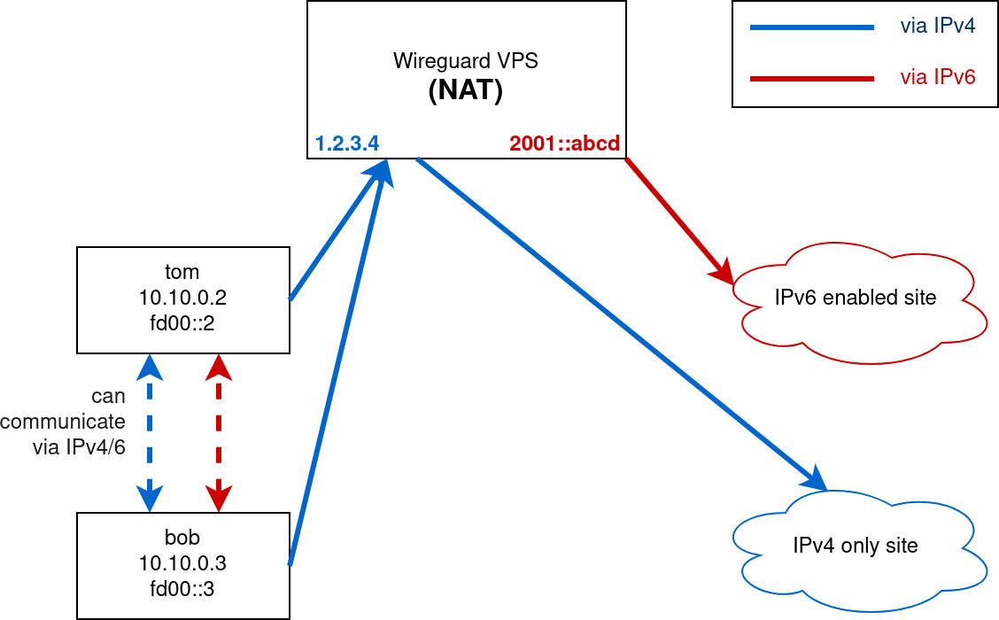

# WGZero
Zero overhead wireguard setup. Tested on Debian 10.

# Table of contents
- [Requirements](#requirements)
    - [IPv6](#ipv6)
        - [NAT](#nat)
        - [SLAAC (still has bugs)](#slaac--still-has-bugs-)
- [Installation](#installation)
- [Other Commands](#other-commands)
- [FAQ, troubleshoot, etc.](#faq--troubleshoot--etc)

# Requirements
- [wireguard](https://www.wireguard.com/install/)
- curl
- qrencode
- iptables
- ipcalc
- jq

## IPv6
If you need IPv6, please make sure you ipv6 works before proceeding.

Tutorial:
- https://www.linode.com/docs/networking/linux-static-ip-configuration
- https://www.vultr.com/docs/configuring-ipv6-on-your-vps

There are 2 types of connection:
### NAT
- public IPv6 is being shared, and internal IPv6 uses ULA
- you need to have IPv6 address similar to `2001::a:b:c:d/64`


### SLAAC (still has bugs)
- assign public IPv6 to each clients
- you need to have IPv6 address similar to `2001:a:b:c::/64`
    - notice the colons, it means that you can assign multiple addresses to clients
    - not every providers provide this, some require opening a ticket (linode provides this, not sponsoring though...)
- make sure you have configuration `/etc/network/interfaces` similar to this
```
iface eth0 inet6 static
    address 2001:a:b:c::/64
    gateway fe80::1
```


# Installation
```bash
curl -sO https://raw.githubusercontent.com/finzzz/wgzero/master/wgzero

chmod +x wgzero
./wgzero install
```

# Other Commands
```
wgzero list
wgzero add clientname
wgzero del clientname
wgzero qr clientname
```

# FAQ, troubleshoot, etc.
- Initial steps on debian
```bash
echo "deb http://deb.debian.org/debian buster-backports main" >> /etc/apt/sources.list
apt update && apt upgrade
apt install linux-headers-$(uname -r) wireguard qrencode ipcalc curl iptables jq
# replace linux-headers-$(uname -r) with linux-headers-amd64 if errors
```

- Running alongside Pihole  
Run `pihole restartdns` after setup